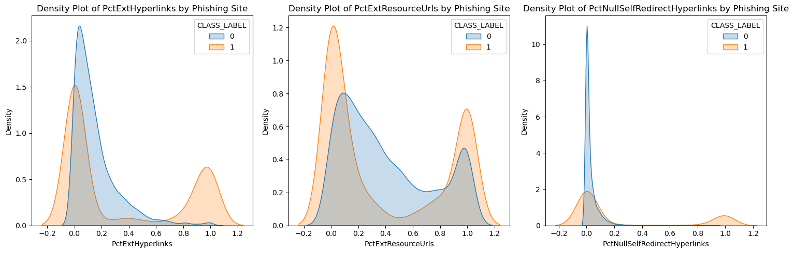

## Employee Attrition Analysis  
    

**The code is available [here](#-githubcode ipynb)**

<br>
<br>
<p align="center">
  
</p>
<br>

<p align="center">
  <a href="#introduction"> Introduction </a> •
  <a href="#problemdef"> Problem Definition </a> •
  <a href="#goal"> Goals </a> •
  <a href="#variable"> Variable Definition </a> •
  <a href="#preprocessing"> Data Cleaning & Preprocessing </a> •
  <a href="#visualization"> Visualization </a> •
  <a href="#feature"> Feature Engineering</a> •
  <a href="#models"> Model Selection & Training</a> •
  <a href="#results"> Model Results</a> •
  <a href="#conclusion"> Conclusion</a> 
</p>

<a id = 'introduction'></a>
## Introduction
 
Phishing is an attack aimed at stealing sensitive information like usernames, passwords, and credit card details by tricking victims into clicking malicious links or downloading malware. These attacks often involve fake websites with URLs that mimic legitimate ones, or links sent via email. In this project, a phishing classifier for websites is evaluated using machine learning algorithms in Python.

<a id = 'problemdef'></a>
## Problem Definition

Phishing websites are a significant cybersecurity threat, imitating legitimate sites to steal sensitive information, which results in financial losses and reputational damage. This project addresses the issue by developing a machine learning-based solution that can automatically detect and flag phishing websites based on their features and user behavior. 

<a id = 'goal'></a>
## Goals

The goal is to identify threats early, reduce the risk of fraud and data breaches, and maintain customer trust.

### Stakeholder Interest 
- Business leaders want to minimize financial and legal risks.
- Security teams benefit from automation, enabling focus on advanced threats.
- Customers enjoy better data protection and feel safer online.
- Regulators and partners value the proactive approach, which supports compliance and trust in the digital environment.

<a id = 'variable'></a>
## Variable Definition

| Column                         | Description                                                                |
|--------------------------------|----------------------------------------------------------------------------|
| NumDots                        | Number of dots in the URL                                                  |
| PathLevel                      | Depth level of the URL path                                                |
| NumDash                        | Number of dash (“-”) characters in the URL                                 |
| NumSensitiveWords              | Count of sensitive words (e.g., "secure", "login", "account") in the URL   |
| PctExtHyperlinks               | Percentage of external hyperlinks on the webpage                           |
| PctExtResourceUrls             | Percentage of external resource URLs (images, scripts, etc.)               |
| InsecureForms                  | Indicates if the webpage contains insecure forms (0 = No, 1 = Yes)         |
| PctNullSelfRedirectHyperlinks  | Percentage of null/self-referencing hyperlinks                             |
| FrequentDomainNameMismatch     | Indicates frequent domain mismatch (0 = No, 1 = Yes)                       |
| SubmitInfoToEmail              | Indicates if the form submits data to email (0 = No, 1 = Yes)              |
| IframeOrFrame                  | Indicates usage of iframe or frame tags (0 = No, 1 = Yes)                  |
| CLASS_LABEL                    | Label of the website (0 = Legitimate, 1 = Phishing)                        |

The target variable is a binary value which equals 1 if website is phishing and equals 0 otherwise.

<a id = 'preprocessing'></a>
## Data Cleaning and Preprocessing

There was no missing value in the dataset; hence there was no need to treat missing observations. 
There were no missing values or duplicate observations in the dataset. The ID variable was removed because it adds no new variation to the analysis. The remaining 47 possible features were many and in analysis can lead to overfitting. Hence, there was the need to select only the most relevant features for classification. 

<a id ='visualization'></a>
## Visualization


<br>
<p align="center">
  
</p>
<br>

The description of the sample plots of three binary varaibles by the target variable are given as follows:
- Websites with insecure forms are more frequent in phishing sites (class_label = 1) than legitimate ones.
- Most phishing websites do not submit form data via email (SubmitInfoToEmail = 0), but those that do are nearly all phishing.
- Phishing websites seem more likely to use iframes/frames than legitimate ones, but many legitimate sites also use them.

<br>
<p align="center">
  
</p>
<br>

- Phishing websites seem to have a bimodal distribution (two peaks), one close to 0 and another around 0.8-1.0, while legitimate sites cluster around lower values.
- Phishing websites appear to have more external resource URLs compared to legitimate ones, which are concentrated at lower percentages.
- Phishing sites show a broader distribution, with a peak near 0, whereas legitimate sites seem to have a sharper peak at very low values.

<a id = 'feature'></a>
## Feature Engineering

To prevent leakage in analysis, the dataset was first divided into two: the training and the validation sets in the ratio 80:20. Feature selection was conducted on the training sets to reduce the number of existing features.

<br>
<p align="center">
  
</p>
<br>


<a id = 'models'></a>
## Models
The following models were trained. 
- Logistic Regression: A linear model that estimates class probabilities using the sigmoid function.
- Decision Tree: A tree-based model that partitions data based on feature values.
- Random Forest: An ensemble method that builds multiple decision trees to improve accuracy.
- Linear Discriminant Analysis: A statistical method for dimensionality reduction and classification.
- K-Nearest Neighbors: A non-parametric method that classifies instances based on their nearest neighbors.
- Support Vector Machine: A model that finds an optimal hyperplane to separate classes.

<a id = 'results'></a>
## Model Results

Results were computed from a pipeline involving train/test split, feature standardization using StandardScaler, training over a loop and storage of model results in a dataframe. Code is as follows: 

```
# Function to train classifiers and compute performance metrics
def evaluate_classifiers(X, y, test_size=0.2, random_state=42):
    """
    Train multiple classifiers and compute Accuracy, Precision, Recall, and F1-score.
    
    Parameters:
        X (DataFrame or array): Feature matrix.
        y (Series or array): Target variable.
        test_size (float): Test split ratio.
        random_state (int): Random seed for reproducibility.
    
    Returns:
        DataFrame: Performance metrics for each classifier.
    """
    # Split dataset into training and testing sets
    X_train, X_test, y_train, y_test = train_test_split(X, y, test_size=test_size, random_state=random_state)
    
    # Standardize features (important for SVM and KNN)
    scaler = StandardScaler()
    X_train_scaled = scaler.fit_transform(X_train)
    X_test_scaled = scaler.transform(X_test)
    
    # Define classifiers
    classifiers = {
        "Logistic Regression": LogisticRegression(random_state=42),
        "Decision Tree": DecisionTreeClassifier(random_state=42),
        "Random Forest": RandomForestClassifier(random_state=42),
        "Linear Discriminant Analysis": LinearDiscriminantAnalysis(),
        "K-Nearest Neighbors": KNeighborsClassifier(),
        "Support Vector Machine": SVC()
    }
    
    # Store results
    results = []

    for name, clf in classifiers.items():
        # Use scaled data for classifiers that require normalization
        if name in ["Support Vector Machine", "K-Nearest Neighbors", "Logistic Regression", "Linear Discriminant Analysis"]:
            clf.fit(X_train_scaled, y_train)
            y_pred = clf.predict(X_test_scaled)
        else:
            clf.fit(X_train, y_train)
            y_pred = clf.predict(X_test)
        
        # Compute metrics
        accuracy = accuracy_score(y_test, y_pred)
        precision = precision_score(y_test, y_pred, average="weighted")
        recall = recall_score(y_test, y_pred, average="weighted")
        f1 = f1_score(y_test, y_pred, average="weighted")
        
        results.append([name, accuracy, precision, recall, f1])
    
    # Convert results to DataFrame
    metrics_df = pd.DataFrame(results, columns=["Classifier", "Accuracy", "Precision", "Recall", "F1-score"])
    
    return metrics_df

```


| Classifier                   | Accuracy | Precision | Recall  | F1-score |
|------------------------------|----------|-----------|---------|----------|
| Logistic Regression          | 0.9050   | 0.9052    | 0.9050  | 0.9050   |
| Decision Tree                | 0.9705   | 0.9706    | 0.9705  | 0.9705   |
| Random Forest                | 0.9795   | 0.9795    | 0.9795  | 0.9795   |
| Linear Discriminant Analysis | 0.8975   | 0.8978    | 0.8975  | 0.8975   |
| K-Nearest Neighbors          | 0.9445   | 0.9446    | 0.9445  | 0.9445   |
| Support Vector Machine       | 0.9395   | 0.9396    | 0.9395  | 0.9395   |

- Random Forest achieved the highest accuracy (97.95%), making it the best-performing classifier.
- Decision Tree follows closely with an accuracy of 97.05%.
- Logistic Regression and Linear Discriminant Analysis have the lowest scores, with LDA performing the weakest.
- K-Nearest Neighbors and Support Vector Machine show similar performance.

<a id = 'conclusion'></a>
## Conclusion

The classification results demonstrate that machine learning can be highly effective in detecting phishing websites. Among the tested models, **Random Forest** outperformed all others, achieving the highest accuracy (97.95%), precision, recall, and F1-score, making it the most reliable classifier for this task. **Decision Tree** closely followed with strong performance metrics as well.

While **Logistic Regression** and **Linear Discriminant Analysis** showed relatively lower performance, they still provide decent baseline models. The **K-Nearest Neighbors** and **Support Vector Machine** models also achieved high performance and could be suitable choices depending on the computational resources and deployment context.

Overall, the use of ensemble methods like Random Forest proves most robust in distinguishing between phishing and legitimate websites, offering an effective tool for mitigating phishing threats and protecting user data.

